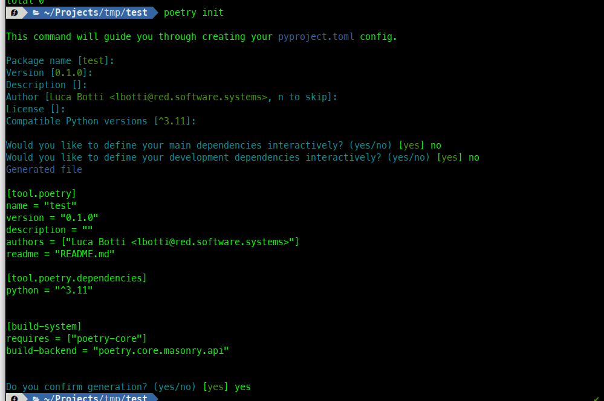
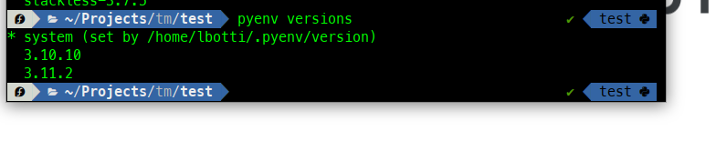
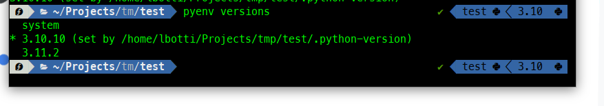
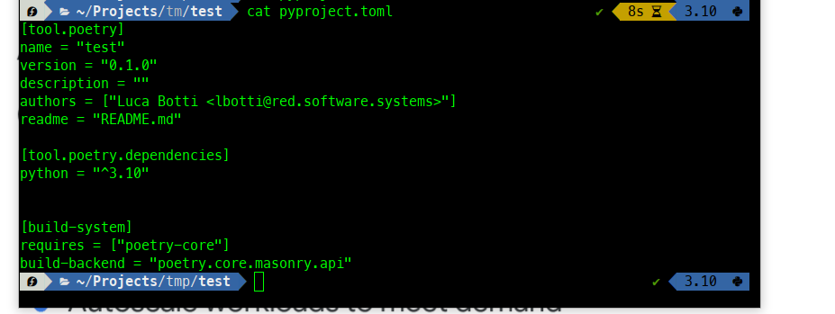
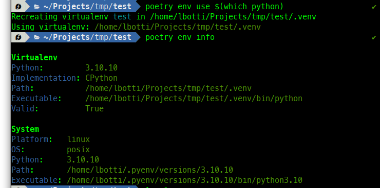

<!--
Checklist:
- [ ] Outline
- [ ] Draft 1
- [ ] Edit
    - [ ] Check trouble / vale
    - [ ] One sentence per line
    - [ ] Check preview in browser
    - [ ] Put in all links
- [ ] Create summary
- [ ] Tidy up
    - [ ] Set publishDate
    - [ ] Toggle draft
    - [ ] Check tags
    - [ ] Remove checklist
    - [ ] Remove outline
- [ ] Publish to hosting

Outline:
- 
-->

# Managing Python Versions in Poetry with PyEnv
I see a lot of confusion on the web how to manage python versions with pyenv and dependencies in poetry. Here is my quick rundown.

Let's start with some clarifications.

Python **needs** virtual environments- being also a (dynamic) system component, **never** add libraries to your core system installation. Whatever is packaged from your distribution (Linux) or OS provider (Windows, MacOS) should be OK, anything else is not. Also using virtual environments keeps your requirements in place (within your project) and makes clear to additional contributors your work and dependencies.
## Virtual Environments
**Virtual Environments** (https://docs.python.org/3/library/venv.html) are added to a Project by various means - they are a set of directories and links that allow to isolate the installed packages (for the virtual environment) from the installed packages (for the system).
Quickest way to add a virtual environment is to write a line in a terminal:

```shell
python -m venv env
```

This will create a virtual environment in the env directory. You can activate it with the usual
```shell
source env/bin/activate
```
After activating the environment, any python package installation (which you perform with a _pip install_ **_packagename_**) will end up in _env_/lib/_python.version_/site-packages.
## Poetry
**Poetry** (https://python-poetry.org/) is a tool to manage your project, including the capability to manage dependencies, and delivering your created package (if any) to PyPI.

After installation, suggested configuration changes are the following:
```shell
poetry config virtualenvs.in-project true
poetry config virtualenvs.options.always-copy true
poetry config virtualenvs.prefer-active-python true
```
First will create your virtual environments in the project directory, second will copy instead of symlinking, third will use the currently activated Python version instead of the one used during Poetry Installation.

After this, a **_poetry init_** will result in the following output:



This will generate the **pyproject.toml** file containing a description of the Project as defined via the input of the init command.

Finally, a **_poetry install_** will create the virtual environment in a hidden directory (.venv) with the (eventually) defined additional packages, and activate it. After this, **_poetry shell_** will be used to activate the virtual environment in later sessions.

The **_poetry add_** _packagename_ will install additional packages in the _.venv_ directory.

## Pyenv
**Pyenv** (https://github.com/pyenv/pyenv) in Linux and MacOS, and **_pyenv-win_** (https://github.com/pyenv-win/pyenv-win) in Windows are the tools used to have multiple versions of Python installed on your system. There are plenty of tutorials on the web, suffice to say that you install the tool and it takes care (being in your path) to create and manage symlinks and various files to manage locally installed Python versions.

Locally installed means that Python gets installed under your home directory ~/.pyenv/… and this directory is referenced from the scripts.

For the Linux users, Pyenv never touches the system python installation. Even when you read about the Global python interpreter, it means the default one for every project.

Just for example, **_pyenv versions_** will show the currently installed (and currently used versions):



**_pyenv local 3.10_** will install (if not already installed) a 3.10 python version and select it as the default version for the current directory.



## Combining everything
Managing your project with poetry, allows you to set the python version for the project, but not to manage the installed python versions.

The suggested sequence to correctly manage everything is the following:

```shell
pyenv local 3.10 # Set the local version to 3.10
poetry env use $(which python) # set the python version to the current one
```

The first command sets the local version to 3.10. The following one sets the environment used by poetry to the currently selected python version (3.10 via the previous command). Two caveats here: the virtual environment shall not be active, otherwise the python version set will be the virtual environment one, and the python poetry dependency (**tool.poetry.dependencies** stanza in pyproject.toml) should be already correctly set:




The result of the **_poetry env use_** command will be the following, confirmed by the _**poetry env info**_ command:



## Finally, your IDE
If you use an IDE (I do, **PyCharm**), you can set the interpreter to a local poetry environment already installed.

## Conclusions
Even if the pattern here can be confusing and seen as complex, the adoption of virtual environments, poetry and pyenv allows for isolation and capability to detach your project from your local system, allowing for a great deal of flexibility and robustness in Python development.